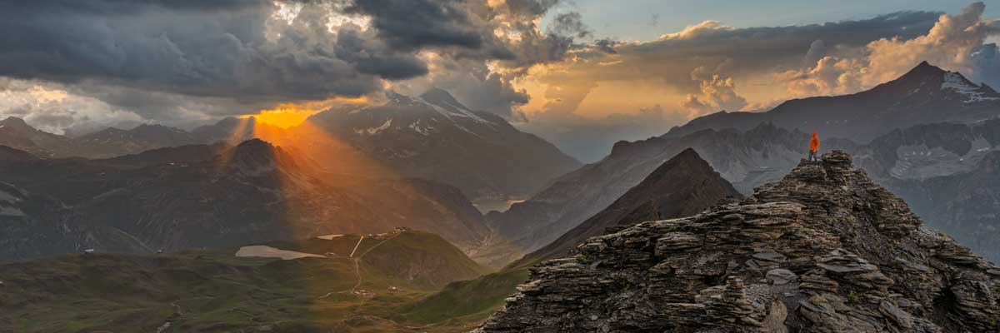

# Cześć, jestem Paweł Słowik

Fotograf z 20+ latami doświadczenia i twórca narzędzi dla fotografów. Łączę fotografię, programowanie i edukację.
Na YouTube prowadzę **Słowik Inspiruje** – vlogi i konkretna wiedza.

## 🔧 Narzędzia dla fotografów

- 🌅 **SUNTIMER** – kalkulator wschodu/zachodu słońca + pozycja księżyca  
  👉 https://www.slowik.eu/sun/

- 🌌 **Mapa Nocnego Nieba (Dark Sky Map)** – znajdź miejsca wolne od LP, idealne do astro  
  👉 https://www.slowik.eu/nocne-niebo/

- 📷 **Sprawdź przebieg migawki (Shutter Count)** – prześlij zdjęcie, poznaj liczbę wyzwoleń  
  👉 https://www.slowik.eu/przebiegaparatu/

- 🕶️ **Kalkulator filtra ND** – precyzyjne czasy naświetlania z filtrami ND  
  👉 https://www.slowik.eu/kalkulatornd/

- 🔍 **Porównywarka ogniskowych** – porównaj kąty widzenia i ekwiwalenty  
  👉 https://www.slowik.eu/ogniskowa/

- 🧬 **IRIS (Lightroom Classic)** – „Twoje fotograficzne DNA”: statystyki, trendy, interaktywne wykresy  
  👉 https://www.slowik.eu/produkt/iris-statystyki-dla-lightroom-classic/

## 🧭 Czym się zajmuję
- Tworzę praktyczne aplikacje, wtyczki i interaktywne mapy dla fotografów.  
- Prowadzę warsztaty 1:1 i foto–wyjazdy (Szkocja, Dolomity, Toskania…).  
- Uczę obróbki (Lightroom/Photoshop) i publikuję presety.

## 📫 Kontakt i więcej

